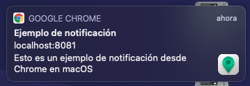
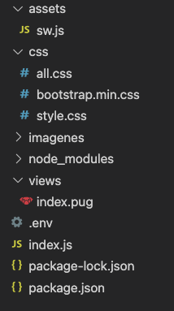

# Servidor de notificaciones Web Push
Servidor de subscripción de notificaciones web Push. Permite enviar notificaciones a aquellos clientes de nuestra web o app que se hayan suscrito al servicio de notificaciones.




## Índice
1. [Introducción](#id1)
2. [Parte Servidor - Funcionamiento](#id2)
3. [Parte Cliente - Funcionamiento](#id3)


---
<div id='id1' />

## Introducción
La compatibilidad con las notificaciones web push, es diversa según el navegador y la plataforma. Algunas variables, iconos y opciones de la notificación no están disponibles en todos los navegadores.

En esta tabla podemos ver su compatibilidad con fecha de Junio de 2021.

|    -    |    Google Chrome   |       Safari       |   Microsoft Edge   |       Firefox      |        Opera       |
|:-------:|:------------------:|:------------------:|:------------------:|:------------------:|:------------------:|
| Android | :white_check_mark: |          -         | :white_check_mark: | :white_check_mark: | :white_check_mark: |
| Windows | :white_check_mark: |          -         | :white_check_mark: | :white_check_mark: | :white_check_mark: |
|   iOS   |         :x:        |         :x:        |         :x:        | :white_check_mark: |         :x:        |
|  macOS  | :white_check_mark: | :white_check_mark: | :white_check_mark: | :white_check_mark: | :white_check_mark: |
|  Linux  | :white_check_mark: |          -         |          -         | :white_check_mark: | :white_check_mark: |

*Fuente: <a href="https://www.goodbarber.com/blog/web-push-notifications-demystified-a866/">GoodBarber</a>*


### Tecnologías utilizadas:
- Backend con NodeJS
- Frontend con el motor de plantillas Pug
- Base de datos implementada con MariaDB
- Estilo del frontend con Bootstrap 4

### Módulos necesarios:
- **koa, koa-router, koa-body**, koa-static: Framework web Koa
- **koa-pug**: Motor de plantillas Pug
- **web-push**: API para las notificaciones push
- **dotenv**: Para el uso de variables globales
- **mariadb**: Conector para la base de datos MariaDB

### Estructura del proyecto



### Variables de entorno utilizadas
**Fichero .env**

```
#Claves pública y privada
PUBLIC_KEY="CLAVE_VAPID_PÚBLICA"
PRIVATE_KEY="CLAVE_VAPID_PRIVADA"

#Credenciales BD MariaDB
HOST="DIRECCION_DE_LA_BD"
DATABASE="NOMBRE_DE_LA_BD"
USER_DB="USUARIO_DE_LA_BD"
PASSWORD="TU_CONTRASEÑA"
CONNECTION_LIMIT="NUMERO_DE_CONEXIONES_LÍMITE"
EMAIL_VAPID="usuario@email.com"
```

---
<div id='id2' />

## Parte Servidor - Funcionamiento

### :large_blue_circle: Generación de las claves VAPID
Las claves VAPID públicas y privadas son las encargadas de autenticar que la conexión entre el servidor de notificaciones y el usuario suscrito es segura y única. Para generar dichas claves, podemos utilizar las funciones que el módulo de *web-push* nos proporciona:
```javascript
const webpush = require('web-push');
// Las claves solo deben ser generadas una vez
const vapidKeys = webpush.generateVAPIDKeys();
console.log(vapidKeys);
```
Dentro del código, accederemos a dichas claves de la siguiente forma a través de variables de entorno almacenadas en el .env:
```javascript
const vapidKeys = {
    publicKey: process.env.PUBLIC_KEY,
    privateKey: process.env.PRIVATE_KEY
};

webpush.setVapidDetails(
    'mailto:'+process.env.EMAIL_VAPID,
    vapidKeys.publicKey,
    vapidKeys.privateKey
);
```

### :large_blue_circle: Endpoints del servicio
A través de Koa habilitaremos los siguientes endpoints que les da funcionalidad al servidor.
```javascript
// Declaración previa del router de Koa
const router = require('koa-router');
const _ = router();
```

####  :small_blue_diamond: GET (/)
Simplemente renderiza el index.pug que se encuentra en la carpeta de vistas (views). En esta vista habrá un formulario, que más adelante se utilizará como forma gráfica de envío de las notificaciones a los usuarios subscritos.
```javascript
// [...]
_.get('/', async ctx => {
    return ctx.render('index');
});
```

####  :small_blue_diamond: POST (/suscribe)
Es el endpoint encargado de suscribir a un nuevo cliente. Inserta los datos recibidos del cliente en la base de datos (MariaDB), necesarios más adelante para el envío de notificaciones.
```javascript
// Conexión previa a la base de datos MariaDB
const pool = mariadb.createPool({
     host: process.env.HOST,
     database: process.env.DATABASE, 
     user: process.env.USER_DB, 
     password: process.env.PASSWORD,
     connectionLimit: process.env.CONNECTION_LIMIT
});

// [...]

_.post('/subscribe', async ctx => {
    const { sub } = ctx.request.body;
    try {
        conn = await pool.getConnection();
        const res = await conn.query("INSERT INTO usuarios value (?, ?, ?)", [sub.endpoint, sub.keys.p256dh, sub.keys.auth]);
        console.log(res);
        conn.end();
    } catch (e) {
        console.log(e);
    }

    ctx.body = 'ok';
});
```

####  :small_blue_diamond: POST (/)
Es el endpoint que utiliza el servidor para hacer una difusión de mensajes. Recibe las variables que componen la notificación, que son enviadas en formato JSON a través de la petición POST.
```json
{
    "title":"TITULO",
    "body":"Este es el cuerpo de la notificación",
    "icon":"icon.png",
    "bagde":"badge.png",
    "action_url":"www.mi-url.com",
    "action_title":"TEST BOTON",
    "action_icon":"action-icon.png"
}
```


El código recibe una lista con todos los usuarios suscritos, y envía la notificación con las variables anteriores a través del módulo de *webpush*.
```javascript
// [...]
_.post('/', async ctx => {
  const { title, body, icon, badge, action_url, action_title, action_icon } = ctx.request.body;

  try {
    conn = await pool.getConnection();
    const filas = await conn.query('SELECT * FROM usuarios')
    var keys = [];
    filas.forEach((fila) => {
        clientes.push({endpoint: fila.endpoint, keys: {  p256dh: fila.p256dh,  auth: fila.auth } });
    })
    conn.end();
    console.log(clientes);
    clientes.forEach(subItem => {
      webpush.sendNotification(subItem, JSON.stringify({ title, body, icon, badge, action_url, action_title, action_icon }));
    });
  } catch (e) {
    console.log(e);
  }

  return ctx.render('index');
});
```
---
<div id='id3' />

## Parte Cliente - Funcionamiento
Dentro del cliente podemos distinguir dos partes: el script JS que se encuentra en la vista de la web (presumiblemente, la web a la que el cliente quiere suscribirse) que realiza distintas peticiones asíncronas, y el Service Worker del cliente, encargado de suscribir al cliente y mostrar las notificaciones.

### :large_blue_circle: Fichero JS del cliente (vista de la app)
Aquí podemos distinguir varias peticiones asíncronas:

#### :small_blue_diamond: Comprobación y muestra de notificaciones
En esta petición, en primer lugar se comprueba que el cliente soporta el uso de Service Workers. Si es un cliente ya suscrito, llama a su Service Worker *(sw.js)* y muestra las notificaciones pendientes del servidor.
```javascript
window.addEventListener('load', async () => {
            if (!'serviceWorker' in navigator) {
                console.log('Service Worker NO SOPORTADO')
                return
            }
            console.log('Service Worker es soportado');

            const sw = await navigator.serviceWorker.register('/sw.js');
            await subscribe();

            console.log('Listo para recibir notificaciones push')
        })
```

#### :small_blue_diamond: Suscripción
A través de esta función, se hace una petición al servidor, donde se procede a registrar (suscribir a las notificaciones) al cliente haciendo uso de la clave pública.

```javascript                
        const subscribe = async () => {
            const serviceWorker = await navigator.serviceWorker.ready; 
            const subscription = await serviceWorker.pushManager.getSubscription(); 

            if (!subscription) {
                console.log('Suscribíendose....');
                const push = await serviceWorker.pushManager.subscribe({ 
                    userVisibleOnly: true,
                    applicationServerKey: "LA_CLAVE_PÚBLICA_VA_AQUÍ"
                })
                console.log('Suscrito correctamente!. ', push);

                await sendToServer(push);
            }
        }
```

#### :small_blue_diamond: Persistencia
Finalmente, mediante esta función, se guarda al cliente en la base de datos, realizando una petición POST al endpoint ```/suscribe```

```javascript
        const sendToServer = async subData => {
            console.log('Guardando en el servidor...');
            await fetch("/subscribe", {
                method: "POST",
                headers: {
                    'content-type': 'application/json'
                },
                body: JSON.stringify({ sub: subData })
            });
        }
```

### :large_blue_circle: Service Worker del cliente (sw.js)
En este fichero tenemos dos listener:

#### :small_blue_diamond: Generación de las notificaciones
Este listener es el encargado de recibir y generar las notificaciones con los datos que ha enviado el servidor (JSON de montaje de la notificación).
```javascript
self.addEventListener('push', function (e) {
    const message = e.data.json();

    const options = {
        body: message.body,
        icon: message.icon,
        bagde: message.badge,
        actions: [{
                action: message.action_url,
                title: message.action_title,
                icon: message.action_icon
            },
        ]
    };

    e.waitUntil(self.registration.showNotification(message.title, options));
});
```

#### :small_blue_diamond: Acción sobre la notificación
Es un listener que muestra por consola cuando se ha recibido la notificación, la cierra y se encarga de abrir la url que está asociada al campo ```data``` de la notificación.
```javascript
self.addEventListener('notificationclick', function (e) {
    console.log('Clic sobre la notificación recibido', e.notification.data);

    e.notification.close();
    e.waitUntil(clients.openWindow(e.notification.data));
});
```
